## DESCRIPCIÓN

**Nombre:** Carlos Alberto Salazar Navarro
**Email:** carlos.salnav@gmail.com
**WhatsApp:** +52 81 3870 1097
**Ciudad:** Apodaca, Nuevo León
**País:** México

## ¿Cómo describirías el propósito de este proyecto? (opcional)

El propósito es principalmente el evaluar habilidades en el frontend, empezando por el diseño de la interfaz, la experiencia de usuario, el uso de componentes eficiente, la capacidad de interpretar instrucciones y diseñar soluciones basadas en un requerimiento.

## ¿Cuál es tu stack tecnológico preferido? ¿Por qué? (opcional)

Es dependiendo el propósito, pero ciertamente me gusta mucho utilizar Django en el backend ya que me es muy familiar, y la sintaxis de Python es muy fácil de entender aún si estas comenzando, además para el apartado de seguridad es bastante robusta. Para el frontend me gusta la opción de utilizar NextJS, porque te permite ser un poco más ordenado para trabajar que utilizando solamente React (React al darte tanta rienda suelta en proyectos en equipo al cabo de un tiempo puede volverse un caos en mi experiencia), y para aplicaciones móviles me gusta mucho Expo pero utilizando Typescript, ya que te simplifica las tareas más tediosas al desarrollar una app. Me gustaría mencionar también que para desarrollar backend en un entorno de JS, NestJS es bastante llamativo aunque tengo muy poca experiencia utilizandolo.

## Descripción de la Solución

El proyecto se trata de una aplicación muy simple de tareas, dentro de sus funcionalidades esta el poder crear, editar, eliminar tareas y poder filtrarlas por el estatus de TO DO, DONE y ALL, todo desde una interfaz muy limpia e intuitiva.

Para crear la solución lo primero que hice antes de ponerme a programar fue el diseñar primero la interfaz que quería, tome de inspiración un poco la app de Google Tasks, hasta que di con un resultado que me agradó.

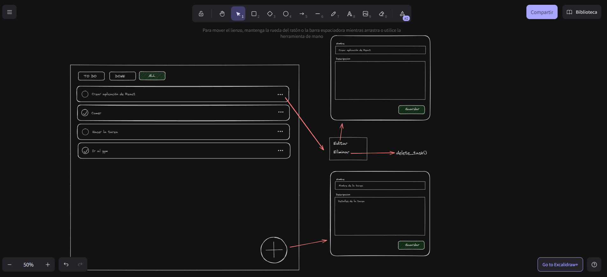

Esta solución esta hecha con el framework de Next.js el cual utiliza React pero da soluciones a problemas frecuentes que da React (la misma documentación de React recomienda mucho utilizar un framework), además de utilizar Typescript.

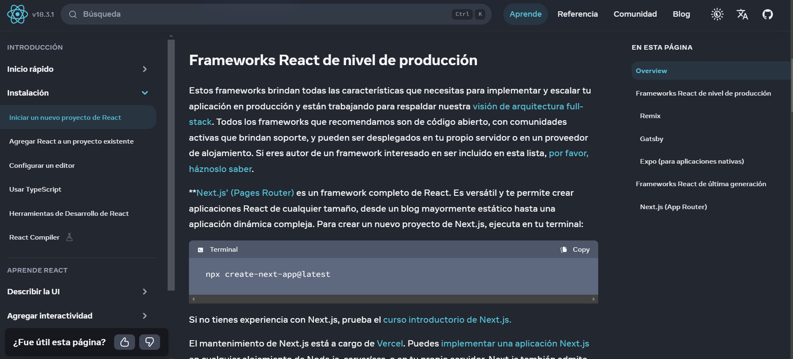

Para esta solución opté por utilizar Vertical Slice Arquitecture, ya que durante este mes he empezado a aprender un poco sobre arquitecturas, y esta fue una que me llamó mucho la atención por la escalabilidad que te permite y lo práctica que es en el mundo real.

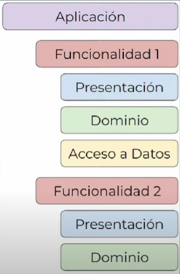

Otro dato importante es que al tratarse unicamente de un proyecto frontend no hago llamadas a ningun servidor para almacenar u obtener tareas, unicamente utilizo el localStorage.

A continuación explico la estructura de carpetas:

- Tenemos la carpeta `src` dentro de la cual esta todo en lo que trabajaremos.
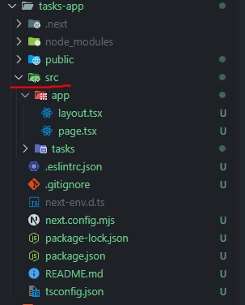

- Tenemos la carpeta `app` la cual tomaremos como nuestra primer feature, esta carpeta unicamente cuenta con el `layout` para toda la pagina y una `page` dentro de la cual se simula una lógica de validación, (en caso de ser más grande dentro de esta feature, estaría toda la parte de la validación del usuario).
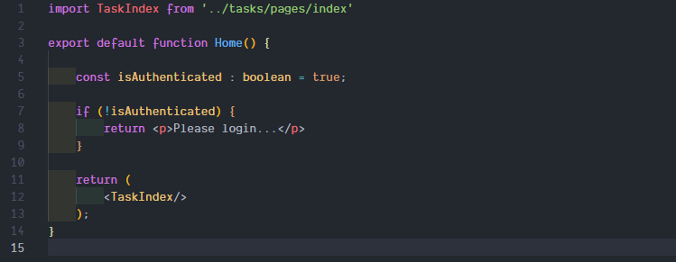

- Tenemos la carpeta `tasks` dentro de la cual prácticamente esta todo la feature relacionada a las tareas, dentro de la carpeta `components`, están todos los componentes que se van a utilizar, dentro de la carpeta `pages` todas las pantallas (en este caso todo se hace unicamente desde una pantalla por lo que solo esta la de index), la carpeta `services` la cual contiene los servicios que los distintos componentes llaman en este caso para filtrar tareas, la carpeta de `types` en donde se establece como se comportarán los modelos (en este caso solo el de Task) y por último una de `utils` en donde se guardarían funciones que se pueden reutilizar, como validaciones.
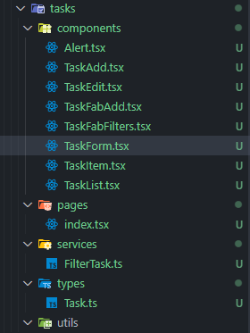

El archivo más "importante" sería el de `TaskList`, puesto que sería el componente padre que termina pasando propiedades al resto de hijos.
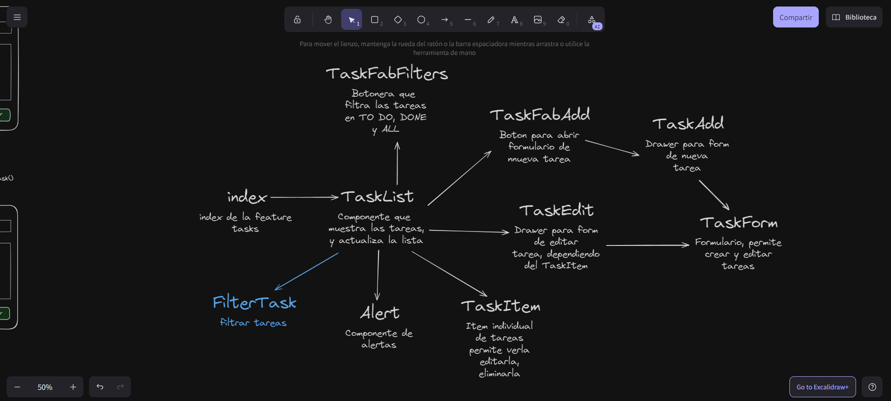

Por último adjunto imagenes de como se ve la solución.
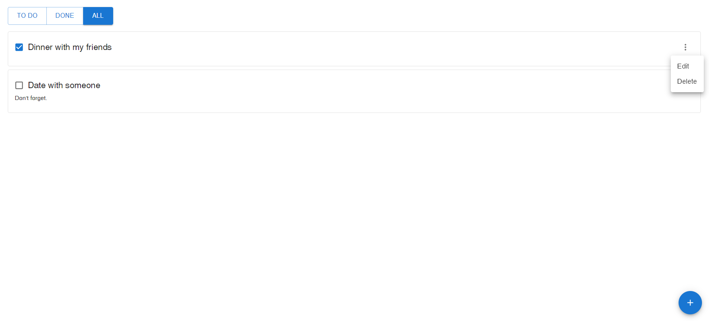
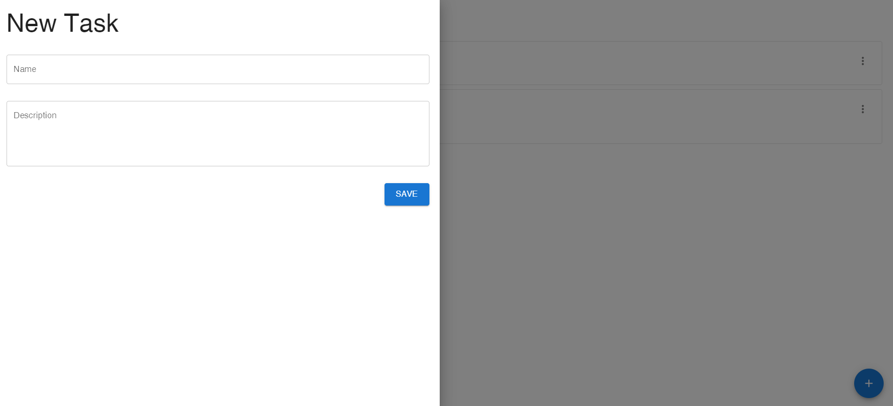
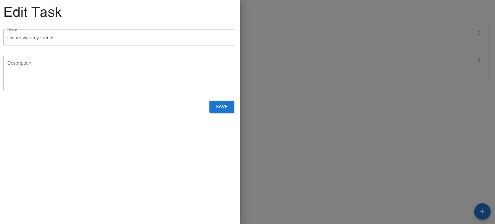
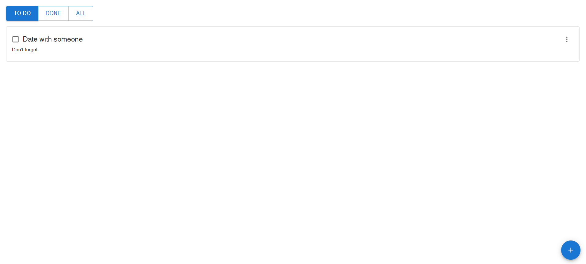

## Instrucciones para Ejecutar el Proyecto

1) Dirigirse al directorio `tasks_app`.
2) Una vez ahi instalar dependencias ejecutando `npm i`
3) Ejecutar `npm run dev` para levantar el servidor local
4) Dirigirse a [http://localhost:3000](http://localhost:3000)

## ¿Que resaltarias de tu proyecto?
- Utilizo Typescript, lo que me permite tener un código más libre de errores, es más sencillo de debuggear, en general el producto es mejor y la experiencia de desarrollo también lo es.
- Utilizo Vertical Slice Arquitecture por lo que ya de entrada no es un monolito como la mayoría de proyectos frontend, lo cual es una ventaja para tener un código más organizado y en caso de aplicaciones más grandes, este será más escalable, y permitirá trabajar en un entorno de equipo.
- Cree la interfaz primero antes de programar (en este caso porque el proyecto es pequeño), lo cual me permitió crear una interfaz bastante intuitiva y limpia para el usuario final, y al tener ya mis funcionalidades bien definidas, fue más sencillo el desarrollo.

## Áreas de oportunidad en el proyecto
A continuación enlisto los aspectos en los que podría mejorar mi proyecto, pero por motivos de tiempo ya no pude incluir:
- Agregar pantallas de carga
- Agregar animaciones al eliminar, marcar o desmarcar una tarea.
- Agregar validaciones al crear o editar tareas, por ejemplo para que no se permita subir tareas con nombre vacío.
- Personalizar un poco más el MUI para darle identidad a la aplicación.